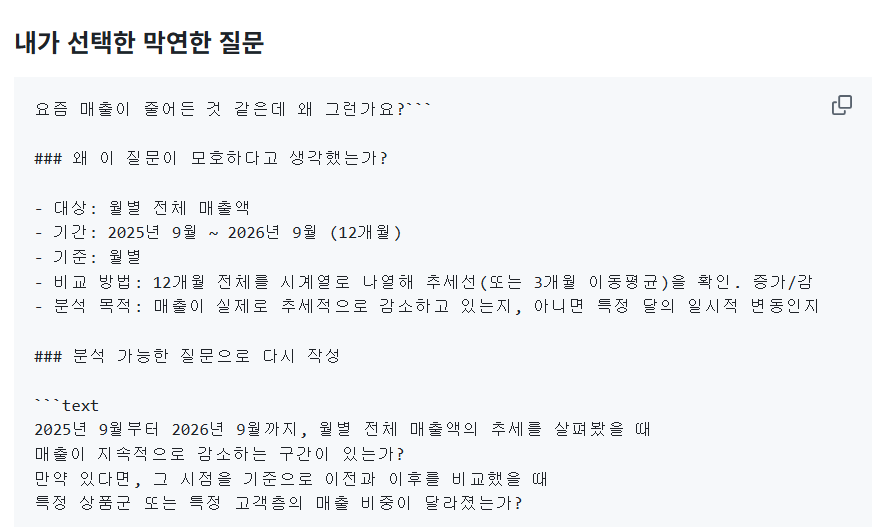
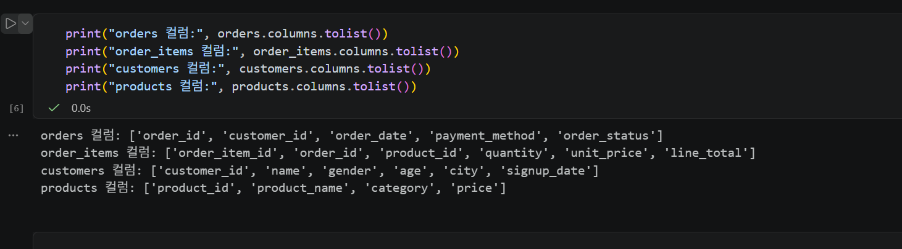
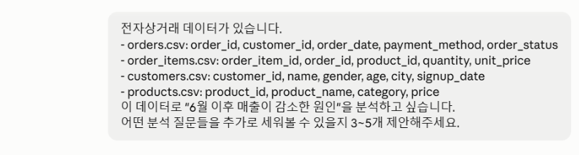
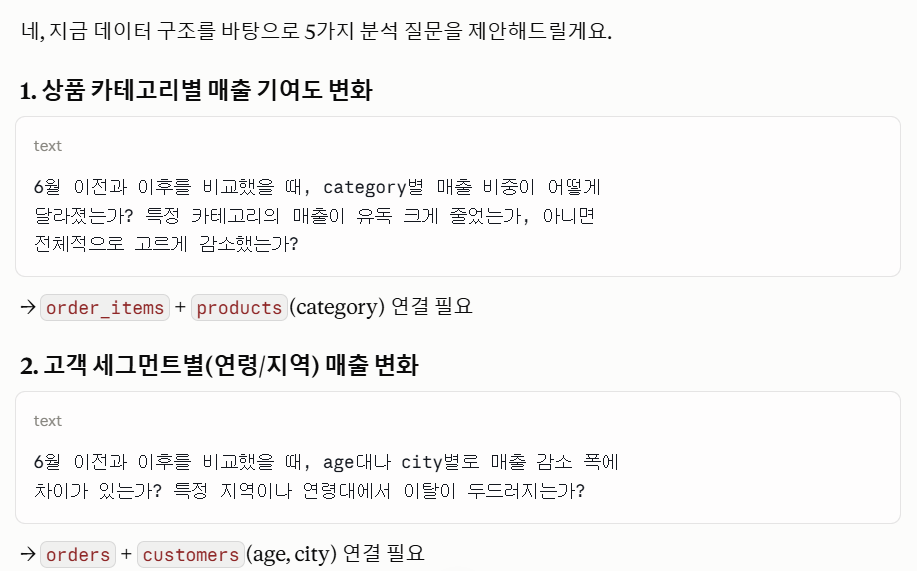
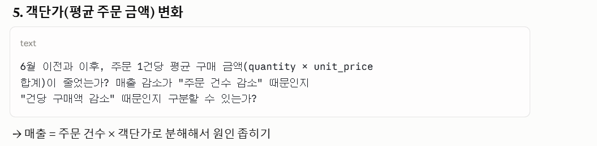
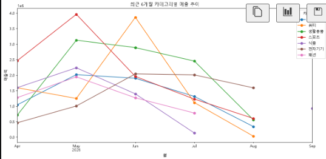
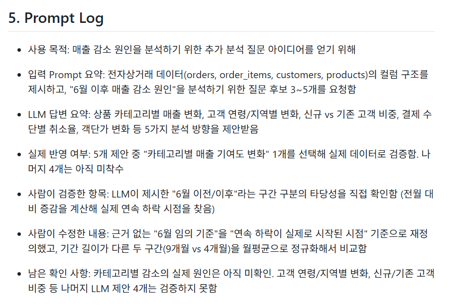
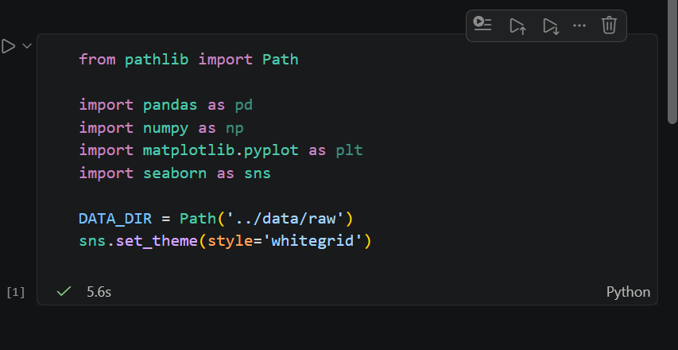

# Chapter 01 제출 답안. AI와 함께하는 데이터 분석의 시작

> 이 파일은 Chapter 01 실습 결과를 정리하여 제출하기 위한 학생용 템플릿입니다.  
> 강사 저장소의 원본 템플릿을 직접 수정하지 말고, 자신의 PC에 복사한 뒤 작성합니다.

---

## 0. 제출 정보

- 이름: 황지원
- GitHub ID: Jiwon0712
- 개인 저장소명: `llm-data-analysis-study`
- 작성일: 2026/09/05
- 사용한 LLM: Claude

### 최종 제출 URL

```text
여기에 개인 GitHub 저장소의 chapter01/chapter01.md 파일 URL을 입력하세요.
```
https://github.com/Jiwon0712/llm-data-analysis-study/blob/main/chapter01/chapter01.md
---

## 1. 원래 업무 질문

### 내가 선택한 막연한 질문

```text
요즘 매출이 줄어든 것 같은데 왜 그런가요?```

### 왜 이 질문이 모호하다고 생각했는가?

- 대상: 월별 전체 매출액
- 기간: 2025년 9월 ~ 2026년 9월 (12개월)
- 기준: 월별
- 비교 방법: 12개월 전체를 시계열로 나열해 추세선을 확인. 그 구간을 중심으로 최근 6개월(2026년 4~9월)의 카테고리별 매출 추이를 비교
- 분석 목적: 매출이 실제로 추세적으로 감소하고 있는지, 아니면 특정 달의 일시적 변동인지 구분하고, 감소 시점이 있다면 그 시점 전후로 특정 상품군·고객층에서 변화가 있었는지 파악

### 분석 가능한 질문으로 다시 작성

```text
2025년 9월부터 2026년 9월까지, 월별 전체 매출액의 추세를 살펴봤을 때
매출이 지속적으로 감소하는 구간이 있는가?
만약 있다면, 그 시점을 기준으로 이전과 이후를 비교했을 때
특정 상품군 또는 특정 고객층의 매출 비중이 달라졌는가?
```

### 결과 관찰

이 단계에서 질문이 어떻게 구체화되었는지 작성하세요.
"요즘 매출이 줄어든 것 같은데 왜 그런가요?"라는 막연한 질문을 구체화하기 위해,
대상(월별 전체 매출액), 기간(2025년 9월~2026년 9월, 12개월),
기준(월 단위 집계), 비교 방법(특정 두 구간이 아닌 12개월 전체 추세와
이동평균 확인)을 정의했다. 실제로 그래프를 그려보니 6월부터 매출이 연속적으로
하락하는 추세가 확인됐고, 이를 근거로 "최근 6개월 카테고리별/고객층별
매출 추이는 어떻게 달라졌는가?"라는 검증 가능한 질문으로
재작성할 수 있었다.

### 나의 해석과 판단

왜 이 질문이 실제 분석에 더 적합하다고 판단했는지 자신의 말로 작성하세요.

처음에는 "6월 이전 vs 이후"처럼 단순히 두 구간을 나눠 비교하려
했지만, 이는 임의의 기준이라 근거가 약했다. 실제로 전월 대비
매출 증감을 계산해보니 6월부터 연속 하락이 확인됐고, 이 사실을
근거로 하락 이전 3개월 vs 하락 구간 시작 후 3개월이라는 구체적인 관찰 범위를 정할 수 있었다.

### 업무·분석적 의미

이 질문에 답하면 어떤 의사결정이나 다음 분석에 도움이 될 수 있는지 작성하세요.

이 질문에 답하면 매출 변화가 단기 노이즈인지 실제 추세인지 구분할 수 있고,
감소가 시작된 시점을 특정하면 그 시점에 어떤 상품군이나 고객층에서
변화가 있었는지 원인을 좁혀갈 수 있다. 이를 바탕으로 재고 조정,
타겟 마케팅, 프로모션 시점 조정 등 구체적인 의사결정에 활용할 수 있다.

### 한계와 추가 확인 사항

현재 질문만으로 알 수 없는 것은 무엇인지 작성하세요.

월별 추세만으로는 매출 변화의 근본 원인(경쟁사 동향, 외부 경제 상황,
날씨 등 데이터 외적 요인)까지는 알 수 없다. 또한 현재 데이터가 12개월치뿐이라
전년 동기 대비 비교가 불가능해, 관찰된 감소가 매년 반복되는 계절적
패턴인지 올해만의 특이 현상인지는 추가 데이터가 쌓여야 확인할 수 있다.

### Evidence



---

## 2. 질문과 필요한 데이터 연결

### 필요한 데이터 파일

- [x] `customers.csv`
- [x] `products.csv`
- [x] `orders.csv`
- [x] `order_items.csv`

### 필요한 컬럼 후보

| 파일 | 필요한 컬럼 | 필요한 이유 |
| --- | --- | --- |
| `orders.csv` | `order_id`, `order_date`, `order_status` | 월별 매출 추세 집계 및 완료 주문 필터링 |
| `order_items.csv` | `order_id`, `product_id`, `quantity`, `unit_price` | 실제 매출 금액 계산(quantity × unit_price) 및 상품 연결 |
| `products.csv` | `product_id`, `category` | 카테고리별 매출 비교 |
| `customers.csv` | `customer_id`, `age`, `city` | 향후 고객층별 원인 분석에 활용 (이번 단계에서는 미사용) |

### 데이터 연결 관계

```text
필요한 PK/FK 관계 또는 파일 연결 관계를 작성하세요.

orders.order_id       ↔ order_items.order_id     ((주문에 포함된 상품 내역 연결)
orders.customer_id    ↔ customers.customer_id    (주문한 고객 정보 연결)
order_items.product_id ↔ products.product_id     (구매한 상품의 카테고리/가격 정보 연결)

```

### 결과 관찰

질문에 답하기 위해 어떤 데이터가 필요하다는 사실을 확인했는지 작성하세요.

"월별 전체 매출액 추세"라는 질문에 답하려면, orders.csv만으로는
매출 금액을 알 수 없고 order_items.csv의 quantity와 unit_price를
곱해야 한다는 것을 확인했다. 또한 orders.csv의 order_status에
completed, cancelled, refunded가 섞여 있어 완료된 주문만 걸러야
정확한 매출이 계산된다는 점도 확인했다. 나아가 매출 변화의 원인을
상품군이나 고객층 단위로 분석하려면 products.csv, customers.csv까지
연결해야 한다는 것을 파악했다.

### 나의 해석과 판단

현재 데이터만으로 질문에 답할 수 있는지 판단하세요.

"월별 매출 추세"라는 1차 질문은 orders.csv와 order_items.csv 두
파일만으로 충분히 답할 수 있다. 실제로 order_id를 기준으로 두 파일을
merge하여 완료 주문만 필터링한 뒤 월별로 집계해보니, 6월 이후
지속적인 매출 감소 추세를 확인할 수 있었다. "왜 감소했는가"라는
2차 질문에 답하려면 products.csv(카테고리)와 customers.csv(연령,
지역)까지 연결해서 어떤 상품군·고객층에서 변화가 있었는지 추가로
살펴봐야 한다.

### 업무·분석적 의미

질문과 데이터 구조를 먼저 연결하는 것이 왜 중요한지 작성하세요.

질문에 필요한 데이터와 그 연결 관계를 먼저 파악하지 않으면, 존재하지
않는 컬럼을 가정하고 코드를 짜다가 시간을 낭비하거나(실제로 status
컬럼 이름이 order_status인 것을 몰라 에러가 발생했었다), 취소/환불된
주문을 매출로 잘못 포함시켜 왜곡된 결론을 낼 위험이 있다. 데이터
구조를 먼저 확인하는 습관이 분석의 정확성과 효율성을 모두 높여준다.

### 한계와 추가 확인 사항

실제 컬럼 존재 여부, 타입, 결측 등 아직 확인하지 못한 부분을 작성하세요.

아직 결측치(누락된 unit_price, order_date 등)가 있는지는 확인하지
못했다. 또한 order_status 값 중 refunded가 매출에서 완전히 제외되어야
하는지, 부분 인정되는지는 회사의 기준을 별도로 확인해야 한다.
현재는 customer_id, product_id를 활용한 원인 분석(상품군/고객층별
매출 비중 변화)까지는 진행하지 않았고, 파일 구조와 연결 관계만
확인한 단계다.

### Evidence

필요한 경우 관계도 또는 데이터 파일 확인 화면을 첨부하세요.



---

## 3. LLM에게 분석 질문 후보 요청

### 사용 목적

```text
왜 LLM을 사용했는지 작성하세요.

지금까지 확인한 월별 매출 추세(2026년 6월 이후 감소 추세)를 바탕으로 이 감소 원인을 어떻게 더 파고들지 아이디어를 LLM에게 물어보고자 한다.
```

### 사용한 Prompt

```text
여기에 실제 사용한 Prompt를 붙여 넣으세요.
단, 개인정보·API Key·Secret은 포함하지 마세요.

전자상거래 데이터가 있습니다.
- orders.csv: order_id, customer_id, order_date, payment_method, order_status
- order_items.csv: order_item_id, order_id, product_id, quantity, unit_price
- customers.csv: customer_id, name, gender, age, city, signup_date
- products.csv: product_id, product_name, category, price

이 데이터로 "6월 이후 매출이 감소한 원인"을 분석하고 싶습니다.
어떤 분석 질문들을 추가로 세워볼 수 있을지 3~5개 제안해주세요.
```

### LLM 답변 요약

LLM의 전체 답변을 그대로 복사하지 말고 핵심 제안 3~5개를 요약하세요.

1. 상품 카테고리별 매출 기여도 변화 확인
2. 고객 연령/지역별 매출 변화 확인
3. 신규 고객 vs 기존 고객 비중 변화 확인
4. 결제 수단별 주문 완료율 변화 확인
5. 객단가(평균 주문 금액) 변화 확인

### 결과 관찰

LLM이 어떤 방향의 질문을 주로 제안했는지 사실 위주로 작성하세요.

LLM은 매출 감소 원인을 "무엇이 팔렸는가"(카테고리, 결제 수단)와
"누가 샀는가"(연령, 지역, 신규/기존 고객) 두 방향으로 나눠
제안했다. 또한 매출을 주문 건수와 객단가로 분해해 원인을
좁혀보라는 제안도 있었다. 보유한 4개 데이터 파일의 컬럼을
모두 활용할 수 있는 방향으로 질문을 제안했다.

### 나의 해석과 판단

좋았던 제안과 그대로 사용하기 어려운 제안을 구분해서 작성하세요.

"객단가 변화"와 "상품 카테고리별 매출 기여도" 제안은 현재 가진 
컬럼만으로 바로 코드를 짜서 검증할 수 있어 실용적이었다. 반면 
"신규 고객 vs 기존 고객 재구매율" 제안은 재구매 여부를 판단할 
별도의 로직(고객별 주문 횟수 계산 등)이 필요해서 바로 사용하기는 
어렵고 추가 설계가 필요하다고 판단했다. 결제 수단별 취소율 제안도 
흥미롭지만, 지금 분석 목적(매출 감소 원인)과는 다소 거리가 있어 
우선순위는 낮다고 판단했다.

### 업무·분석적 의미

LLM이 분석 시작 단계에서 어떤 도움을 줄 수 있다고 생각하는지 작성하세요.

LLM은 내가 미처 생각하지 못한 분석 각도(예: 객단가 분해, 신규/기존 
고객 구분)를 짧은 시간에 여러 개 제시해줘서, 분석 초기 브레인스토밍 
단계의 시간을 크게 줄여준다. 

### 한계와 추가 확인 사항

LLM 답변에서 실제 데이터로 검증해야 할 내용을 작성하세요.

LLM이 제안한 질문들이 실제로 유의미한 결과를 낼지는 아직 
데이터로 검증하지 않았다. 특히 "신규 고객 감소" 가설은 
customers.signup_date와 orders.order_date를 함께 봐야 하는데, 
아직 실제로 코드를 돌려 확인하지 못했다. 다음 단계에서 
이 중 하나를 골라 실제 데이터로 검증이 필요하다.

### Evidence

### Evidence




---

## 4. LLM 제안 검증

LLM 제안 중 하나 이상을 선택해 검토합니다.

| 검증 항목 | 확인 내용 |
| --- | --- |
| 검증 항목 | 확인 내용 |
| --- | --- |
| 질문 | 최근 6개월(2026년 4~9월) 동안 카테고리별 매출 추이가 어떻게 달라졌는가? |
| 필요한 파일 | 저장소에 존재함 — `order_items.csv`, `products.csv`, `orders.csv` |
| 필요한 컬럼 | 실제 컬럼명이 예상과 달랐음 — 상태 컬럼은 `status`가 아닌 `order_status`, 단가 컬럼은 `price`가 아닌 `unit_price`였음을 확인 후 수정 |
| 계산 범위 | order_status가 completed인 주문만 매출로 인정. LLM이 제시한 "6월 이전(1~5월) vs 이후(6~9월)" 단순 비교 대신, 전월 대비 증감을 계산해 하락이 시작된 시점을 확인하고 최근 6개월(2026-04~2026-09) 구간의 카테고리별 월별 추이로 계산 범위를 재정의함 |
| 결과 해석 | 모든 카테고리가 하락 구간 안에서 감소하는 흐름을 보였으나, 카테고리별로 감소 속도와 폭에 차이가 있었음. 이는 상관관계일 뿐이며 감소의 실제 원인(마케팅, 재고, 계절성 등)을 알 수 없으므로 원인으로 단정하지 않음 |
| 사용 여부 | 수정 후 사용 |

### 내가 수정한 내용

```text
LLM 제안을 수정했다면 무엇을 어떻게 바꿨는지 작성하세요.

1. 필요한 컬럼명이 예상과 달랐다 —
order_status(상태), unit_price(단가)로 실제 이름을 확인 후
사용했다.
2. LLM이 처음 제시한 "6월 이전(1~5월) vs 이후(6~9월)"
구간 비교는 근거가 부족하다고 판단해 사용하지 않았고, 대신
전체 12개월 그래프에서 하락이 뚜렷했던 최근 6개월
(2026-04~2026-09)로 범위를 좁혀 카테고리별 월별 매출 추이를
확인했다.
3. completed 상태의 주문만 매출로 필터링하는 조건을 추가했다.
```

### 결과 관찰

검증 과정에서 확인된 사실을 작성하세요.

LLM이 제안한 "6월 이전(1~5월) vs 이후(6~9월)" 구간 비교는 
근거가 부족하다는 것을 확인했다. 실제로 전월 대비 매출 증감을 
계산해보니 6월부터 연속 하락이 시작됐고, 이를 근거로 최근 
6개월(2026년 4월~9월) 구간의 카테고리별 매출 추이를 확인하는 
것으로 검증 방법을 수정했다. 또한 order_status 컬럼에 
completed, cancelled, refunded 값이 섞여 있어, 완료된 주문만 
필터링해야 정확한 매출이 계산된다는 사실도 검증 과정에서 
다시 확인했다.

### 나의 해석과 판단

왜 `사용 / 수정 후 사용 / 보류` 중 해당 결정을 내렸는지 작성하세요.

LLM의 제안 방향(카테고리별 비교) 자체는 유효했지만, 구체적인
계산 방법(기간을 임의로 둘로 나눠 합계 비교)에는 근거가 부족했다.
최근 6개월 구간을 월별로 이어서 보는 방식이, 하락이 진행되는
과정 자체를 보여줘 "이전 vs 이후"보다 더 직관적이고 설득력
있다고 판단해 수정 후 사용했다.

### 업무·분석적 의미

LLM 제안을 검증하지 않고 바로 사용하는 경우 어떤 문제가 생길 수 있는지 작성하세요.

만약 order_status 필터링 없이 cancelled·refunded 주문까지
매출에 포함시켰다면 실제보다 부풀려진 매출 수치가 나왔을 것이다.
또한 LLM이 제안한 "6월 이전/이후" 구간을 그대로 나눠 단순
합계로 비교했다면, 기간 길이가 다른 두 구간(9개월 vs 4개월)을
공정하지 않게 비교하게 되어 하락기 쪽이 실제보다 훨씬 더
나빠 보이는 왜곡된 결론에 이르렀을 것이다.

### 한계와 추가 확인 사항

아직 실제 데이터로 검증하지 못한 부분을 명확히 작성하세요.

이번 검증은 매출이 "감소했다는 사실"과 "카테고리별 감소 폭 차이"
까지만 확인했을 뿐, 감소의 실제 원인(마케팅 중단, 재고 부족, 
경쟁사 등장, 계절적 요인 등)은 데이터만으로 알 수 없다. 특히 
스포츠·식품 카테고리가 왜 유독 크게 줄었는지는 추가로 확인이 
필요하다. 또한 이번 분석은 상품 카테고리 관점에서만 봤을 뿐, 
고객 연령·지역별 변화나 신규 vs 기존 고객 비중, 결제 수단별 
이탈 등 3번에서 LLM이 제안했던 나머지 관점은 아직 검증하지 
못했다.

### Evidence



---

## 5. Prompt Log

- 사용 목적: 매출 감소 원인을 분석하기 위한 추가 분석 질문 아이디어를 얻기 위해

- 입력 Prompt 요약: 전자상거래 데이터(orders, order_items, customers, 
  products)의 컬럼 구조를 제시하고, "6월 이후 매출 감소 원인"을 
  분석하기 위한 질문 후보 3~5개를 요청함

- LLM 답변 요약: 상품 카테고리별 매출 변화, 고객 연령/지역별 변화, 
  신규 vs 기존 고객 비중, 결제 수단별 취소율, 객단가 변화 등 
  5가지 분석 방향을 제안받음

- 실제 반영 여부: 5개 제안 중 "카테고리별 매출 기여도 변화" 1개를 
  선택해 실제 데이터로 검증함. 나머지 4개는 아직 미착수

- 사람이 검증한 항목: LLM이 제시한 "6월 이전/이후"라는 구간 구분의 
  타당성을 직접 확인함 (전월 대비 증감을 계산해 실제 연속 하락 
  시점을 찾음)

- 사람이 수정한 내용: 근거 없는 "이전 vs 이후 두 구간 비교" 대신, 
  하락이 뚜렷한 최근 6개월(2026-04~2026-09) 구간을 대상으로 
  카테고리별 월별 매출 추이를 하나의 라인 차트로 그려 비교하는 
  방식으로 변경함. completed 상태의 주문만 매출로 포함하도록 
  필터링 조건도 추가함

- 남은 확인 사항: 카테고리별 감소의 실제 원인은 아직 미확인. 
  고객 연령/지역별 변화, 신규/기존 고객 비중 등 나머지 LLM 제안 
  4개는 검증하지 못함

### 결과 관찰

LLM 사용 기록에서 어떤 의사결정 과정을 확인할 수 있는지 작성하세요.

Prompt Log를 정리해보니, LLM의 제안을 그대로 받아들이지 않고 
구간 설정 방식을 검증하고 수정한 과정이 명확히 기록으로 남았다.

### 나의 해석과 판단

Prompt Log를 남기는 것이 왜 필요한지 자신의 말로 작성하세요.

Prompt Log를 남기면, 나중에 왜 이런 분석 방법을 선택했는지 
스스로도 다시 확인할 수 있고, 다른 사람이 이 분석을 검토할 때도 
LLM 제안과 사람의 판단이 어디서 갈렸는지 확인할 수 있다. 
이는 LLM 활용 과정의 신뢰성을 높이는 데 필수적이라고 생각한다.

### Evidence



---

## 6. 개인정보와 Secret 보호 확인

다음 항목을 확인합니다.

- [x] 실제 이름·이메일·전화번호 등 고객 개인정보를 Prompt에 사용하지 않았습니다.
- [x] API Key를 코드나 Notebook에 직접 작성하지 않았습니다.
- [x] `.env` 실제 내용을 캡처하거나 업로드하지 않았습니다.
- [x] GitHub Token, 비밀번호, 내부 URL이 캡처에 보이지 않습니다.
- [x] 제출 전 이미지까지 다시 확인했습니다.

### 나의 판단

이번 실습에서 어떤 정보는 LLM 또는 Public GitHub에 올리면 안 된다고 판단했는지 작성하세요.

이번 실습에서 사용한 customers.csv는 실제 개인정보가 아닌 
가상의 샘플 데이터였지만, 실무에서는 이런 데이터라도 LLM 
Prompt에 넣을 때 실제 이름·연락처 같은 식별 정보는
포함시키면 안 된다고 판단했다. 나는 LLM에게 질문할 때 컬럼 
이름만 전달하고 실제 데이터 값은 넣지 않았는데, 
이는 개인정보뿐 아니라 회사의 민감한 매출 수치 등도 마찬가지로 
외부 LLM에 그대로 노출하지 않는 것이 안전하다고 생각한다. 
또한 .env 파일의 API Key 같은 기밀 정보는 코드에 직접 쓰지 않고 
환경변수로 분리해서 관리해야 실수로 GitHub에 올라가는 것을 
막을 수 있다는 것도 이번 실습을 통해 다시 확인했다.
---

## 7. Chapter 01 Notebook 확인

Notebook:

```text
notebooks/ch01_ai_data_analysis_intro.ipynb
```

### 내 환경 상태

- [ ] 아직 환경설정 전이라 Notebook 위치만 확인했습니다.
- [x] 환경설정이 완료되어 Notebook을 직접 실행했습니다.

### 환경설정 완료 학생만 작성

#### 실행한 코드

```python
from pathlib import Path

import pandas as pd
import numpy as np
import matplotlib.pyplot as plt
import seaborn as sns

DATA_DIR = Path('../data/raw')
sns.set_theme(style='whitegrid')
```

#### 실행 결과

```text
오류 없이 실행되었는지 작성하세요.

오류 없이 정상적으로 실행되었다 (실행 번호 [1], 소요 시간 약 5.6초). 

```

#### 결과 관찰

실행 결과에서 확인한 사실을 작성하세요.

별도의 출력값 없이 pandas, numpy, matplotlib, seaborn 라이브러리 
import와 DATA_DIR 경로(../data/raw) 설정, seaborn 테마 설정만 
이루어졌다.

#### 나의 해석과 판단

현재 Notebook이 본격 분석이 아니라 starter scaffold라는 의미를 자신의 말로 설명하세요.

현재 Notebook은 아직 실제 데이터를 불러와서 분석하는 코드는 없었고, pandas, numpy, matplotlib, seaborn과 같은 라이브러리를 import하고 DATA_DIR 경로만 지정하는 것이 전부였다. 즉 이 notebook은  앞으로 강의를 들으면서 채워나갈 분석을 위한 starter scaffold라는 뜻이다. 실제 질문 설정이나 데이터 결합, 시각화 같은 본격적인 분석은 chapter01.md의 과정을 통해 별도로 수행했고, 이 notebook은 그 작업들을 앞으로 코드 형태로 정리해나갈 기본 환경을 미리 준비한 것으로 이해했다. 

#### 한계와 추가 확인 사항

Chapter 02 또는 Chapter 03에서 추가로 확인해야 할 내용을 작성하세요.

현재 notebook에는 DATA_DIR 경로만 지정되어 있고, 실제로 데이터 파일들을 이 경로에서 정상적으로 불러올 수 있는지 확인하지 않았다. Ch 02나 Ch 03에서 이 scaffold 위에 실제 데이터 분석이나 시각화, 통계 요약 코드가 어떻게 추가되는지, 그리고 지금 chapter01.md에서 직접 수행한 분석과 어떤 방식으로 연결되는지 확인해야 한다. 

#### Evidence



> 환경설정 전이라면 이 이미지는 생략할 수 있습니다.

---

## 8. Chapter 01 최종 해석

### 이번 장에서 가장 중요하다고 생각한 내용

```text
자신의 말로 3~5문장 작성하세요.

가장 중요했던 것은 애매한 질문을 분석 가능한 질문으로 구체화하는 과정이었다. 매출이 줄어든 것 같다는 모호한 문장은 코드로 옮길 수 없기 때문에, 대상·기간·기준·비교 방법·목적을 각각 정의해야 분석이 가능하다. LLM이 제안한 아이디어를 그대로 쓰지 않고 근거를 검증한 뒤 구간을 다시 정의한 경험에서, LLM이 방향은 제시해줄 수 있지만 그 방향이 타당한지 검증하는 것은 나의 몫임을 깨달았다. 
```

### LLM을 데이터 분석에 사용할 때 가장 조심해야 할 점

```text
자신의 판단을 작성하세요.

LLM이 제안하는 분석 방법이나 기준을 검증 없이 그대로 코드에 반영하면, 근거가 약한 결론이 나올 수도 있다. 통계적으로 공정하지 않은 비교 방식을 그대로 따라가면 실제보다 과장되거나 왜곡된 결과를 얻었던 예시가 있다. 또 LLM은 데이터의 실제 값을 직접 보지 못하므로 제안한 컬럼명이나 로직이 실제 데이터와 다를 수도 있으므로 코드 작성 시 염두에 두어야 한다. 
```

### 사람과 LLM의 역할 차이

| 항목 | LLM이 도울 수 있는 부분 | 사람이 책임져야 하는 부분 |
| --- | --- | --- |
| 질문 정의 | 막연한 질문을 구체화할 방향과 예시를 여러 개 제안 | 실제 업무 목적에 맞는 질문인지 최종 판단 |
| 데이터 확인 | 어떤 컬럼이 필요할지 제안 | 실제 데이터를 열어 컬럼명·타입·결측치를 직접 검증 |
| 코드 작성 | 초안 코드를 빠르게 생성 | 코드의 비교 기준, 필터 조건 등이 타당한지 검토·수정 |
| 결과 해석 | 결과 패턴에 대한 가능한 해석을 제시 | 실제 원인 단정 여부를 판단하고 추가 확인이 필요한 부분을 구분 |
| 최종 판단 | 참고할 만한 여러 옵션 제공 | 어떤 제안을 신뢰하여 사용할지 최종 결정 |

### 다음 Chapter에서 확인하고 싶은 것

```text
이번 장에서 남은 의문이나 Chapter 02~03에서 확인하고 싶은 내용을 작성하세요.
```
다음 챕터에서는 고객 연령·지역별 분석이나 
신규/기존 고객 비중 변화처럼, 이번에 다루지 못한 다른 관점의 
분석을 통해 원인을 더 좁혀나가는 방법을 배우고 싶다. 또한 
ch01_ai_data_analysis_intro.ipynb 같은 공식 Notebook을 
활용해 지금까지의 분석을 정식 코드로 정리하는 방법도 
익히고 싶다.
---

## 9. 최종 제출 체크리스트

- [x] 원래 업무 질문과 구체화한 분석 질문을 작성했습니다.
- [x] 질문에 필요한 데이터 파일과 컬럼 후보를 정리했습니다.
- [x] LLM Prompt와 답변 요약을 작성했습니다.
- [x] LLM 제안을 실제 데이터 관점에서 검증했습니다.
- [x] 각 핵심 STEP의 결과 관찰을 작성했습니다.
- [x] 각 핵심 STEP의 나의 해석과 판단을 작성했습니다.
- [x] 업무·분석적 의미를 작성했습니다.
- [x] 한계와 추가 확인 사항을 작성했습니다.
- [x] 핵심 실행 Evidence 이미지를 첨부했습니다.
- [x] 이미지가 Markdown에서 정상 표시됩니다.
- [x] 개인정보가 없습니다.
- [x] API Key·Secret·Token이 없습니다.
- [x] 개인 GitHub 저장소에 업로드했습니다.
- [x] GitHub에서 Markdown과 이미지가 정상 표시됩니다.
- [x] 아래 최종 파일 URL이 정상적으로 열립니다.

### 최종 파일 URL

```text
https://github.com/Jiwon0712/llm-data-analysis-study/blob/main/chapter01/chapter01.md
```

---

## 10. 교수자 확인용 요약

### 수행 상태

- [ ] COMPLETE
- [ ] PARTIAL

### 내가 가장 중요하게 내린 판단 1개

```text
여기에 작성하세요.
```

### 아직 확인이 필요한 내용 1개

```text
여기에 작성하세요.
```
